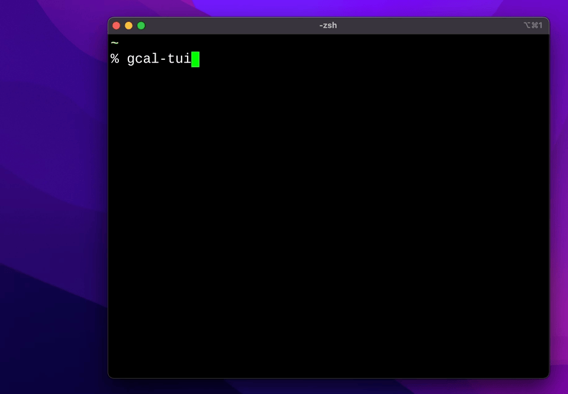

gcal-tui
========

A terminal UI client for Google Calendar.



Preparation
-----------

gcal-tui interfaces directly with Google's Calendar API. You will be defining your own application to which you will authorize yourself.

1. Go to https://console.cloud.google.com/ and either select an existing project or create a new one (e.g "personal-stuff"), then select it.
2. Left sidebar > "APIs & Services" > Library > Search for and enable the Google Calendar API
2. Left sidebar > "Credentials" > "Create Credentials" > "OAuth Client ID"
3. If your consent screen isn't configured, click the "Configure consent screen" button. Pick between Internal and External per your preference.
4. Configure the consent screen:
  - App name: gcal-tui (or whatever you want)
  - User support email: <your email>
  - Developer contact information: <your email>
5. Once at the scopes screen, click "Add or Remove Scopes". Type `calendar.events` and select the googleapis.com URL that appears. Click the checkbox to the left of the item you've just added.
6. Save and continue. Add your email to the Test Users list. Save and continue.
7. You're almost done. Click 'Back to Dashboard', then go back to the Credentials screen.
8. Click "Create credentials" > "OAuth Client ID" > "Desktop app"
9. On the "OAuth client created" screen that pops up, click "Download JSON".

Save the file as `<config_home>/gcal-tui/credentials.json`. If you're not sure where this is, run gcal-tui once and it will tell you.

```
$ mkdir ~/.config/gcal-tui
$ mv Downloads/client_secret_<snip>.json ~/.config/gcal-tui/credentials.json
```

10. Run gcal-tui and visit the authorization URL. Follow the instructions and once you're done, you'll be able to use gcal-tui.